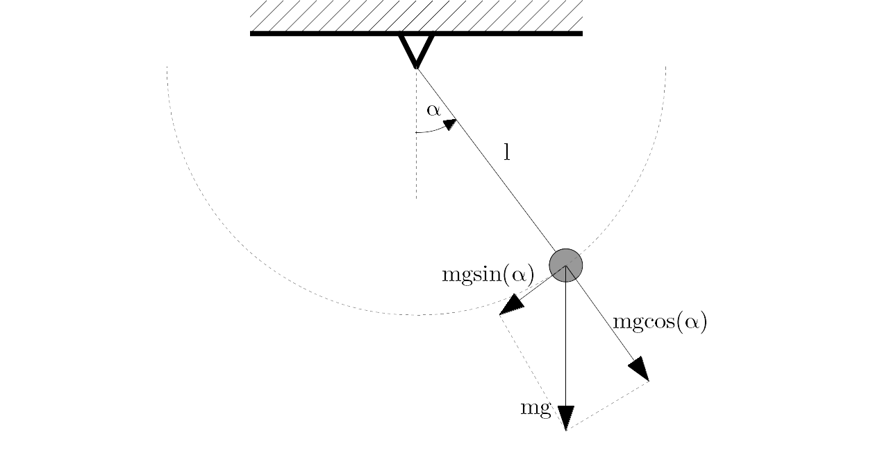

```{r setup, include=FALSE}
knitr::opts_chunk$set(echo = TRUE)
```

# Techniki komputerowe II - zadanie domowe nr 2

**Zadanie:** Różniczkowe równania ruchu wahadła matematycznego o dużym wychyleniu tzn. $\sin(\alpha) \neq \alpha$

***********************

## Wyprowadzenie

Opiszmy ruch punktu materialnego we współrzędnych biegunowych o początku w punkcie zamocowania nici. Ponieważ nić jest nieważka i nierozciągliwa, stale pozostaje prosta, a punkt porusza się po okręgu o promieniu $l$. Na potrzeby tego modelu załóżmy że odchylenie nici od pionu nie przekracza $\frac{\pi}{2}$.



Wtedy:

##### Równowaga sił na kierunku normalnym:
$$\sum F^n = 0$$
$$-N + m \cdot \cos(\alpha) = 0$$
$$N = m \cdot \cos(\alpha)$$

gdzie $N$ to napięcie nici

##### Zasada zmienności krętu:
$$\overline\varepsilon \cdot I = \sum \overline M_0$$
$$I = m \cdot l^2$$
$$\varepsilon = \frac{d^2\alpha}{dt^2}$$
$$\sum M_0 = M_0 (m \cdot \overline{g} ) = - l \cdot m \cdot g \cdot \sin(\alpha)$$
$$\frac{d^2\alpha}{dt^2} = -\frac{g}{l}\sin(\alpha)$$

Jeśli dodatkowo wprowadzimy prędkość kątową $\Large{ \omega = \frac{d\alpha}{dt} }$, można przekształcić powyższe równanie różniczkowe II rzędu na układ dwóch równań I rzędu:
$$\Large{ \begin{cases} \frac{d\omega}{dt} = -\frac{g}{l}\sin(\alpha) \\ \frac{d\alpha}{dt} = \omega \end{cases} }$$

### Energia mechaniczna

Energia mechaniczna jest sumą energii mechanicznej potencjalnej i kinetycznej:
$$ E_m = E_p + E_k $$
Ponieważ jednorodne pole grawitacyjne które jest zadane w tym zadaniu jest polem potencjalnym, można liczyć energię potencjalną grawitacji jako różnicę potencjałów. Przyjmując za poziom odniesienia położenie równowagi, otrzymujemy:
$$ E_p = m \cdot g \cdot h_{obecne} - m \cdot g \cdot h_{odniesienia} \implies E_p = m \cdot g \cdot \Delta h \implies E_p = m \cdot g \cdot l \cdot \Big(1 - cos(\alpha) \Big)$$
Energię kinetyczną obliczymy korzystając z podstawowego wzoru:
$$\large{ \begin{cases} E_k = \frac{m \cdot v^2}{2} \\ v = \omega \cdot l \end{cases} } \implies E_k = \frac{1}{2} \cdot m \cdot \omega^2 \cdot l^2$$
Ponieważ masa punktu nie wpływa na opis ruchu, jedynie na wartość energii mechanicznej, dla wygody przedstawimy energię po podzieleniu przez masę.
$$ e_m = \frac{E_m}{m} = \frac{E_p + E_k}{m} = g \cdot l \cdot \Big(1 - cos(\alpha) \Big) + \frac{1}{2} \cdot \omega^2 \cdot l^2$$

\pagebreak

## Przykładowe dane

### Zestaw 1:

Przyspieszenie ziemskie $g = 9,81 [\frac{m}{s^2}]$, wahadło długości $l = 1[m]$, o początkowym wychyleniu $\alpha_0 = \frac{\pi}{3} = 60^\circ$, bez nadanej prędkości początkowej

```{r mydata, echo=FALSE}
mydata = read.table("../Wahadlo/output.txt", header = TRUE)
plot(mydata["t"]$t, mydata["alfa"]$alfa, type="o", xlab="Czas [s]", ylab="Wychylenie [rad]")
lines(mydata["t"]$t, rep(0, 100))
plot(mydata["t"]$t, mydata["omega"]$omega, type="o", xlab="Czas [s]", ylab="Prędkość kątowa [rad/s]")
lines(mydata["t"]$t, rep(0, 100))
plot(mydata["t"]$t, mydata["energia"]$energia, type="o", xlab="Czas [s]", ylab="Energia mechaniczna [J/kg]", ylim = c(0, 5))
lines(mydata["t"]$t, rep(0, 100))
```

\pagebreak

### Zestaw 2:

Przyspieszenie ziemskie $g = 9,81 [\frac{m}{s^2}]$, wahadło długości $l = 3[m]$, o początkowym wychyleniu $\alpha_0 = \frac{\pi}{6} = 30^\circ$, z nadaną początkową prędkością $\omega_0 = \frac{\pi}{4} [\frac{1}{s}] = 45^\circ [\frac{1}{s}]$

```{r mydata2, echo=FALSE}
mydata2 = read.table("../Wahadlo/output2.txt", header = TRUE)
plot(mydata2["t"]$t, mydata2["alfa"]$alfa, type="o", xlab="Czas [s]", ylab="Wychylenie [rad]")
lines(mydata2["t"]$t, rep(0, 100))
plot(mydata2["t"]$t, mydata2["omega"]$omega, type="o", xlab="Czas [s]", ylab="Prędkość kątowa [rad/s]")
lines(mydata2["t"]$t, rep(0, 100))
plot(mydata2["t"]$t, mydata2["energia"]$energia, type="o", xlab="Czas [s]", ylab="Energia mechaniczna [J/kg]", ylim = c(0, 7))
lines(mydata2["t"]$t, rep(0, 100))
```

